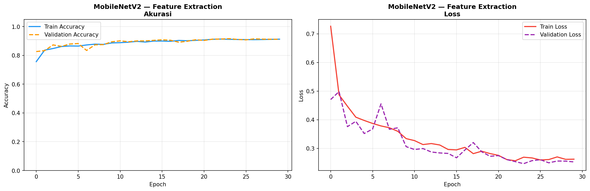
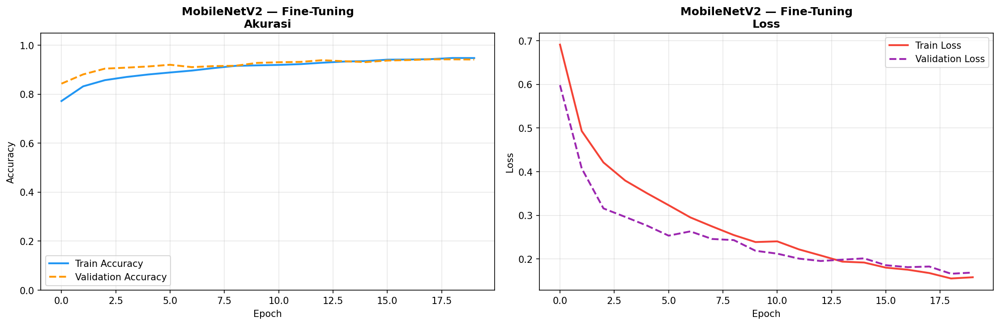
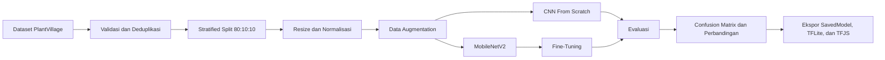

<div align="center">

# 🌿 Tomato Leaf Disease Classification

### Klasifikasi 10 Kondisi Daun Tomat Menggunakan CNN dan MobileNetV2


Proyek deep learning untuk mengklasifikasikan penyakit daun tomat dari dataset **PlantVillage** menggunakan dua pendekatan: **CNN From Scratch** dan **Transfer Learning MobileNetV2 dengan Fine-Tuning**.

[Dataset](https://www.kaggle.com/datasets/gusliza/plantvillage) · [Notebook](notebook/plantvillage_cnn_classification.py) · [Model](models) · [Hasil Visualisasi](results)

</div>

---

## 📌 Tentang Proyek

Sistem ini dirancang untuk mengenali kondisi kesehatan daun tomat berdasarkan citra digital. Proses pengembangan mencakup pembersihan dataset, validasi gambar, deduplikasi, pembagian data secara terstratifikasi, augmentasi, pelatihan dua arsitektur, evaluasi, inferensi, dan ekspor model untuk berbagai platform deployment.

### Model yang Dibandingkan

| Model | Pendekatan | Tujuan |
|---|---|---|
| **CNN From Scratch** | Arsitektur CNN dibangun dan dilatih dari awal | Menjadi baseline performa klasifikasi |
| **MobileNetV2** | Transfer learning, feature extraction, dan fine-tuning | Memanfaatkan fitur pralatih ImageNet untuk meningkatkan generalisasi |

---

## 🗂️ Kelas Dataset

Dataset terdiri dari **10 kelas** kondisi daun tomat:

| No. | Nama Kelas | Keterangan |
|---:|---|---|
| 1 | `bacterial_spot` | Bercak bakteri |
| 2 | `early_blight` | Hawar awal |
| 3 | `healthy` | Daun sehat |
| 4 | `late_blight` | Hawar akhir |
| 5 | `leaf_mold` | Jamur daun |
| 6 | `septoria_leaf_spot` | Bercak daun Septoria |
| 7 | `target_spot` | Bercak target |
| 8 | `tomato_mosaic_virus` | Virus mosaik tomat |
| 9 | `tomato_yellow_leaf_curl_virus` | Virus keriting daun kuning tomat |
| 10 | `two_spotted_spider_mite` | Tungau laba-laba berbintik dua |

Dataset dibagi menggunakan proporsi **80% training, 10% validation, dan 10% testing** dengan pendekatan stratified split agar proporsi setiap kelas tetap seimbang.

---

# 📊 Data Visualization dan Hasil Eksperimen

Seluruh grafik berikut disimpan di folder [`results/`](results).

## 1. Distribusi Dataset

Visualisasi jumlah gambar setiap kelas pada data training, validation, dan testing, sekaligus proporsi keseluruhan split dataset.

<p align="center">
  
</p>

## 2. Contoh Gambar Setiap Kelas

Contoh citra daun tomat dari masing-masing kelas yang digunakan dalam proses pelatihan.

<p align="center">
  
</p>

## 3. Hasil Data Augmentation

Augmentasi diterapkan pada data training menggunakan rotasi, pergeseran, zoom, shear, dan horizontal flip untuk meningkatkan variasi data dan mengurangi risiko overfitting.

<p align="center">
  
</p>

## 4. CNN From Scratch

<table>
  <tr>
    <td align="center"><strong>Training History</strong></td>
    <td align="center"><strong>Confusion Matrix</strong></td>
  </tr>
  <tr>
    <td></td>
    <td></td>
  </tr>
</table>

Grafik training history memperlihatkan perubahan accuracy dan loss pada data training serta validation. Confusion matrix menunjukkan distribusi prediksi model untuk seluruh kelas pada data testing.

## 5. MobileNetV2 — Feature Extraction

Pada tahap pertama, backbone MobileNetV2 dibekukan dan hanya classification head yang dilatih.

<p align="center">
  
</p>

## 6. MobileNetV2 — Fine-Tuning

Sebagian layer terakhir MobileNetV2 dibuka kembali dan dilatih menggunakan learning rate yang lebih kecil.

<p align="center">
  
</p>

## 7. Gabungan Feature Extraction dan Fine-Tuning

Garis pemisah pada grafik menunjukkan transisi dari tahap feature extraction menuju fine-tuning.

<p align="center">
  
</p>

## 8. Confusion Matrix MobileNetV2

<p align="center">
  
</p>

## 9. Perbandingan Performa Model

Perbandingan test accuracy antara CNN From Scratch dan MobileNetV2 Fine-Tuned.

<p align="center">
  
</p>

## 10. Hasil Inferensi

Contoh prediksi MobileNetV2 Fine-Tuned pada gambar dari testing set. Label hijau menandakan prediksi benar, sedangkan label merah menandakan prediksi yang tidak sesuai dengan kelas aktual.

<p align="center">
  
</p>

---

## ⚙️ Alur Pengembangan



---

## 🧠 Konfigurasi Pelatihan

| Parameter | Nilai |
|---|---:|
| Ukuran input | `224 × 224 × 3` |
| Batch size | `32` |
| Maksimum epoch CNN Scratch | `50` |
| Maksimum epoch Feature Extraction | `30` |
| Maksimum epoch Fine-Tuning | `20` |
| Optimizer | Adam |
| Loss function | Categorical Crossentropy |
| Learning rate CNN Scratch | `1e-3` |
| Learning rate Feature Extraction | `1e-3` |
| Learning rate Fine-Tuning | `1e-5` |
| Random seed | `42` |

Callback yang digunakan:

- `EarlyStopping` untuk menghentikan training ketika validation loss tidak lagi membaik.
- `ReduceLROnPlateau` untuk menurunkan learning rate secara adaptif.
- `ModelCheckpoint` untuk menyimpan model dengan validation accuracy terbaik.

---

## 📁 Struktur Repository

```text
PlantVillage/
├── notebook/
│   └── plantvillage_cnn_classification.py
├── models/
│   ├── best_scratch.keras
│   ├── best_tl_stage1.keras
│   ├── best_tl_finetune.keras
│   └── exports/
│       ├── class_names.json
│       ├── plantvillage_tomato_classifier.tflite
│       ├── plantvillage_tomato_classifier_savedmodel/
│       └── plantvillage_tomato_classifier_tfjs/
├── results/
│   ├── distribusi_dataset.png
│   ├── contoh_gambar.png
│   ├── augmentasi.png
│   ├── history_scratch.png
│   ├── cm_cnn_from_scratch.png
│   ├── history_tl_stage1.png
│   ├── history_ft.png
│   ├── history_combined.png
│   ├── cm_mobilenetv2_fine-tuned.png
│   ├── perbandingan_model.png
│   └── inferensi_hasil.png
├── prepare_dataset.py
├── requirements.txt
└── README.md
```

---

## 🚀 Menjalankan Proyek

### 1. Clone Repository

```bash
git clone https://github.com/Gslza/PlantVillage.git
cd PlantVillage
```

### 2. Buat Virtual Environment

#### Windows PowerShell

```powershell
python -m venv .venv
.\.venv\Scripts\Activate.ps1
```

#### Linux atau macOS

```bash
python3 -m venv .venv
source .venv/bin/activate
```

### 3. Instal Dependensi

Untuk menjalankan script persiapan dataset:

```bash
pip install -r requirements.txt
```

Untuk menjalankan keseluruhan eksperimen deep learning:

```bash
pip install tensorflow kagglehub tensorflow-addons tensorflowjs \
    numpy pandas matplotlib seaborn scikit-learn pillow
```

### 4. Persiapkan Dataset

Contoh perintah untuk membersihkan dan membagi dataset:

```bash
python prepare_dataset.py \
    --source "Dataset of Tomato Leaves/plantvillage/Preprocessed data" \
    --output "dataset_clean" \
    --train-ratio 0.8 \
    --val-ratio 0.1 \
    --test-ratio 0.1 \
    --seed 42 \
    --overwrite
```

Untuk melakukan simulasi tanpa menyalin file:

```bash
python prepare_dataset.py --dry-run
```

### 5. Jalankan Notebook

Buka file [`notebook/plantvillage_cnn_classification.py`](notebook/plantvillage_cnn_classification.py) di Google Colab atau ubah kembali menjadi notebook `.ipynb`, kemudian jalankan setiap tahap secara berurutan menggunakan GPU.

---

## 📦 Model dan Format Deployment

| Artefak | Lokasi | Kegunaan |
|---|---|---|
| CNN terbaik | `models/best_scratch.keras` | Evaluasi atau inferensi dengan Keras |
| MobileNetV2 stage 1 | `models/best_tl_stage1.keras` | Model setelah feature extraction |
| MobileNetV2 fine-tuned | `models/best_tl_finetune.keras` | Model utama setelah fine-tuning |
| TensorFlow SavedModel | `models/exports/plantvillage_tomato_classifier_savedmodel/` | Deployment server atau TensorFlow Serving |
| TensorFlow Lite | `models/exports/plantvillage_tomato_classifier.tflite` | Deployment mobile, edge, atau embedded |
| TensorFlow.js | `models/exports/plantvillage_tomato_classifier_tfjs/` | Inferensi melalui browser atau aplikasi web |
| Label kelas | `models/exports/class_names.json` | Pemetaan indeks output menjadi nama kelas |

> Model berukuran besar dikelola menggunakan **Git LFS**. Pastikan Git LFS telah terpasang sebelum melakukan clone penuh terhadap seluruh artefak model.

```bash
git lfs install
git lfs pull
```

---

## 🛠️ Teknologi yang Digunakan

- Python
- TensorFlow dan Keras
- MobileNetV2
- NumPy dan Pandas
- Matplotlib dan Seaborn
- Scikit-learn
- Pillow
- KaggleHub
- TensorFlow Lite
- TensorFlow.js
- Git LFS

---

## 👨‍💻 Identitas

**Gusli Yanza**  
NIM: `8030230056`  
Kelas: `01PK6`  
Program Studi Sistem Komputer

---

<div align="center">

Dikembangkan sebagai proyek klasifikasi citra penyakit daun tomat menggunakan deep learning.

⭐ Berikan star pada repository ini apabila proyeknya bermanfaat.

</div>
