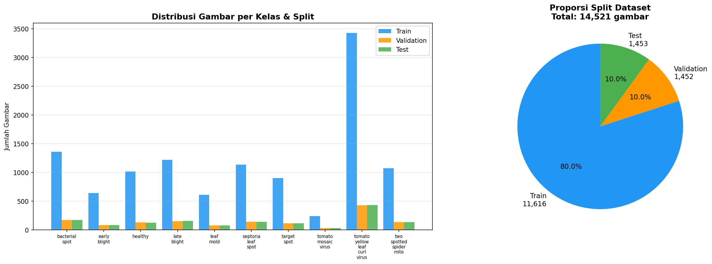
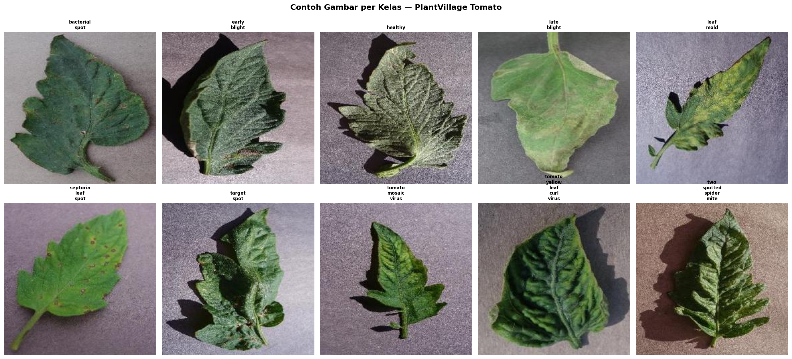
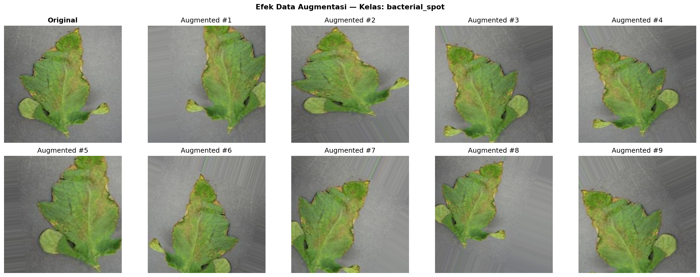
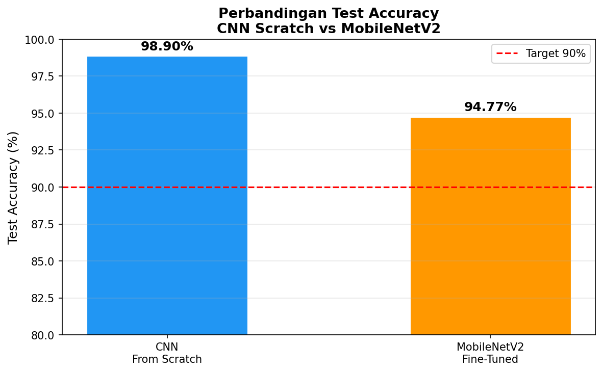
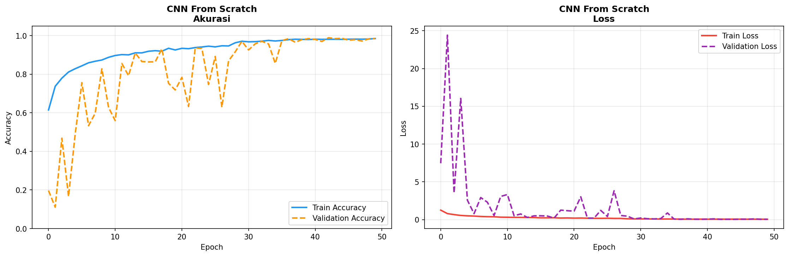
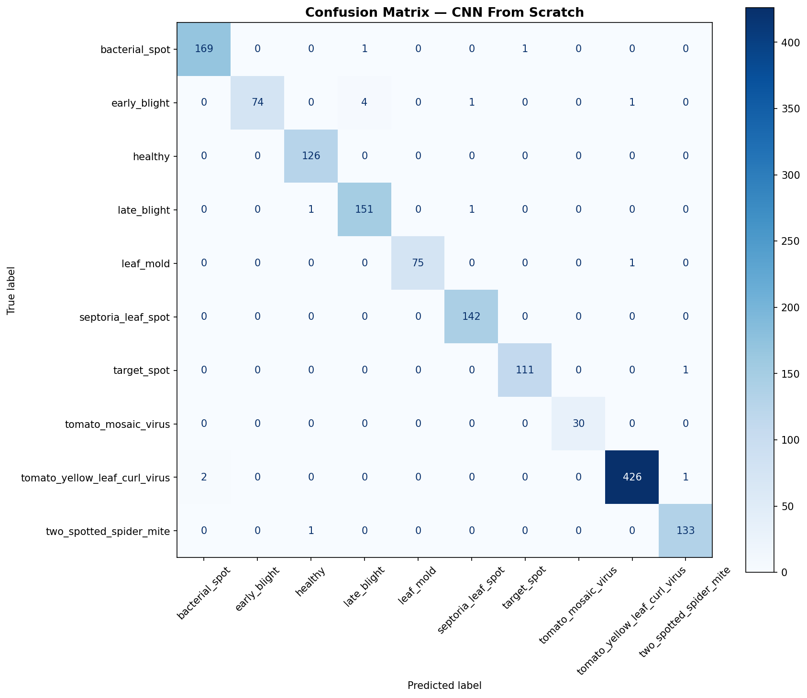
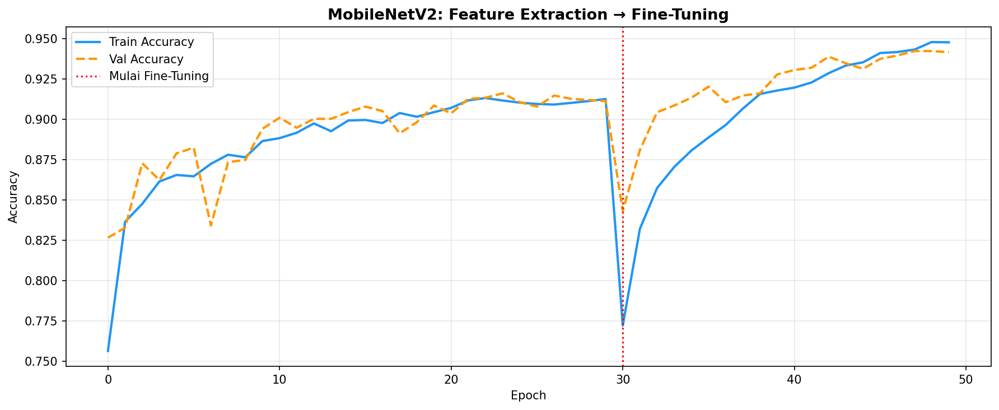
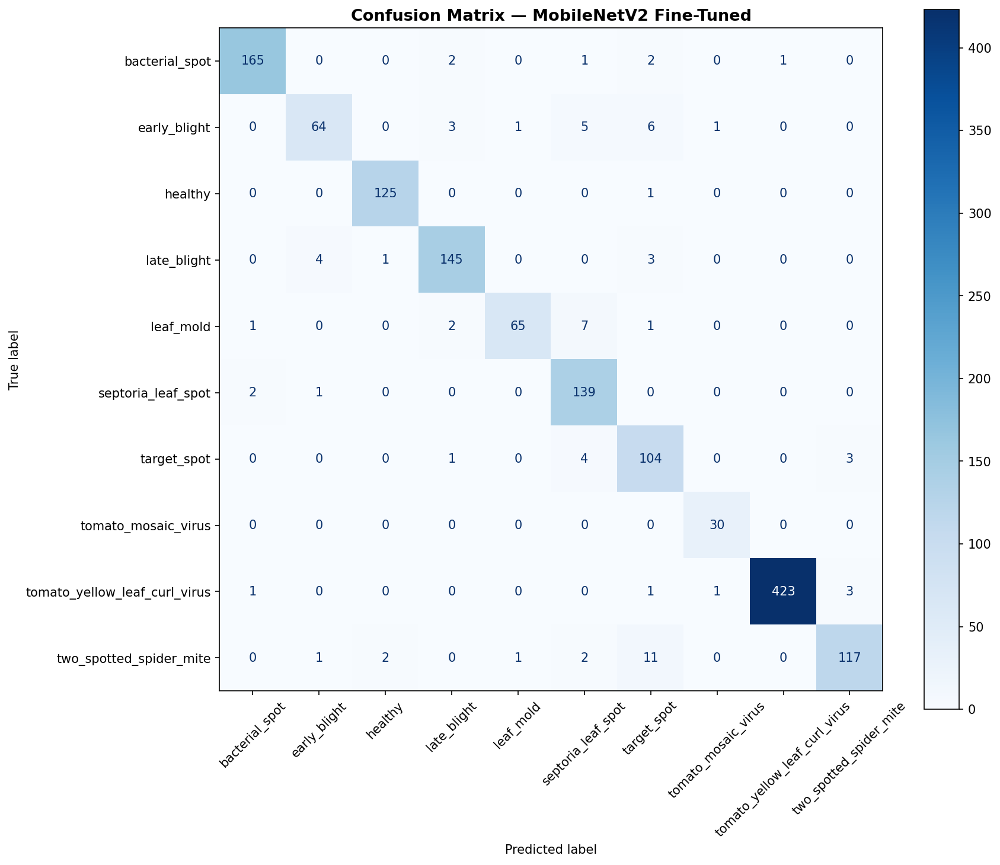
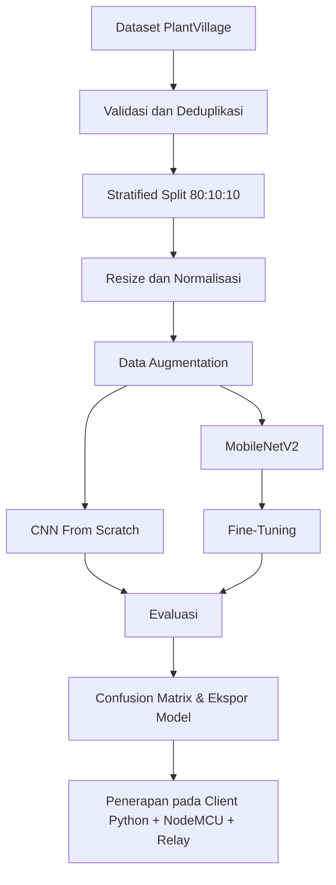

<div align="center">

# 🌿 Tomato Leaf Disease Classification & AIoT Relay Control

### Klasifikasi 10 Kondisi Daun Tomat Menggunakan CNN & Real-Time AIoT Relay Control


Proyek ini mengintegrasikan **Deep Learning** dan **Internet of Things (AIoT)** untuk mengklasifikasikan 10 kategori kondisi daun tomat dari dataset **PlantVillage** menggunakan model CNN (Scratch & MobileNetV2), lalu mengirimkan instruksi serial secara real-time ke **NodeMCU ESP8266 / ESP32** untuk mengendalikan **4-Channel Relay** dan indikator LED.

[Dataset](https://www.kaggle.com/datasets/gusliza/plantvillage) · [Notebook](notebook/plantvillage_cnn_classification.py) · [Model](models) · [Hasil Visualisasi](results) · [AIoT Client (Python)](python) · [Arduino Sketch](arduino)

</div>

---

## 📌 Tentang Proyek

Sistem ini dirancang untuk mengenali kondisi kesehatan daun tomat berdasarkan citra digital dari webcam dan mengambil tindakan fisik melalui relay. 

Proyek ini mencakup dua bagian utama:
1. **Model Klasifikasi (Deep Learning):** Melatih model CNN Scratch dan MobileNetV2 Fine-Tuned untuk mendeteksi 10 kelas kondisi daun tomat secara akurat.
2. **Sistem Kontrol AIoT (Hardware & Serial):** Mengambil keputusan real-time dari video webcam, melakukan filtering stabilitas (debounce), mengirimkan sinyal melalui koneksi serial USB ke ESP8266/ESP32, dan menyalakan relay/LED yang relevan dengan tipe penyakit daun yang terdeteksi.

### Model yang Dibandingkan

| Model | Pendekatan | Tujuan |
|---|---|---|
| **CNN From Scratch** | Arsitektur CNN dibangun dan dilatih dari awal | Menjadi baseline performa klasifikasi |
| **MobileNetV2** | Transfer learning, feature extraction, dan fine-tuning | Memanfaatkan fitur pralatih ImageNet untuk akurasi maksimal |

---

## 🏗️ Arsitektur Sistem AIoT

```text
Webcam
  ↓
Python + OpenCV (Ambil Frame & Ekstrak ROI)
  ↓
CNN Image Classification (best_scratch.keras)
  ↓
Confidence Filtering (Prediksi diterima jika ≥ 60%)
  ↓
Consecutive Frame Debounce (Harus stabil selama 5 frame berturut-turut)
  ↓
State Change Detection (Hanya kirim serial jika status relay berubah)
  ↓
PySerial melalui USB (115200 baud)
  ↓
NodeMCU ESP8266 / ESP32
  ↓
4-Channel Relay (Logika Active-Low)
  ↓
LED / Lampu DC Tegangan Rendah
```

Lihat diagram detail arsitektur di [`diagrams/system_architecture.md`](diagrams/system_architecture.md).

---

## 📁 Struktur Repository

```text
PlantVillage/
├── python/                              ← Aplikasi Client Python (AIoT)
│   ├── aiot_inference.py                ← Program utama real-time inference
│   ├── serial_test.py                   ← Script uji coba koneksi serial & relay
│   ├── camera_test.py                   ← Script uji coba webcam
│   ├── model_test.py                    ← Script uji coba load model & dummy inference
│   ├── config.py                        ← Konfigurasi terpusat (port, threshold, dll.)
│   ├── utils.py                         ← Fungsi pembantu (state manager, drawing overlay)
│   └── requirements.txt                 ← Dependensi Python
│
├── arduino/                             ← Firmware Mikrokontroler (Arduino IDE)
│   ├── esp8266_tomato_relay/
│   │   └── esp8266_tomato_relay.ino     ← Sketch untuk NodeMCU ESP8266
│   └── esp32_tomato_relay/
│       └── esp32_tomato_relay.ino       ← Sketch untuk ESP32
│
├── models/                              ← Penyimpanan File Model CNN (.keras)
│   ├── best_scratch.keras               ← Model utama CNN scratch (10.3 MB)
│   ├── best_tl_stage1.keras             ← Model transfer learning stage 1 (13.6 MB)
│   ├── best_tl_finetune.keras           ← Model transfer learning fine-tuned (25.8 MB)
│   └── exports/                         ← Hasil konversi model untuk platform lain
│       ├── class_names.json             ← Mapping label index ke nama kelas
│       ├── plantvillage_tomato_classifier.tflite                ← Format TensorFlow Lite (Mobile/Edge)
│       ├── plantvillage_tomato_classifier_savedmodel/           ← Format SavedModel (.pb)
│       └── plantvillage_tomato_classifier_tfjs/                 ← Format TensorFlow.js (Browser)
│
├── results/                             ← Hasil grafik & visualisasi eksperimen
│   ├── distribusi_dataset.png
│   ├── contoh_gambar.png
│   ├── augmentasi.png
│   ├── history_scratch.png
│   ├── cm_cnn_from_scratch.png
│   ├── history_tl_stage1.png
│   ├── history_ft.png
│   ├── history_combined.png
│   ├── cm_mobilenetv2_fine-tuned.png
│   ├── perbandingan_model.png
│   └── inferensi_hasil.png
│
├── diagrams/                            ← Dokumentasi teknis sistem
│   ├── system_architecture.md           ← Diagram arsitektur data & state machine
│   └── wiring_table.md                  ← Panduan tabel wiring hardware
│
├── logs/                                ← Output log deteksi otomatis (CSV)
├── screenshots/                         ← Tempat penyimpanan screenshot tangkapan kamera
├── prepare_dataset.py                   ← Script utility pembersihan & splitting dataset
├── requirements.txt                     ← Dependensi umum root
└── README.md                            ← Dokumentasi utama ini
```

---

## 🗂️ Kelas Dataset

Dataset terdiri dari **10 kelas** kondisi daun tomat:

| No. | Nama Kelas | Keterangan | Kategori Relay | Perintah Serial |
|---:|---|---|:---:|:---:|
| 1 | `bacterial_spot` | Bercak bakteri | Bacterial | `B` |
| 2 | `early_blight` | Hawar awal | Fungal | `F` |
| 3 | `healthy` | Daun sehat | Healthy | `H` |
| 4 | `late_blight` | Hawar akhir | Fungal | `F` |
| 5 | `leaf_mold` | Jamur daun | Fungal | `F` |
| 6 | `septoria_leaf_spot` | Bercak daun Septoria | Fungal | `F` |
| 7 | `target_spot` | Bercak target | Fungal | `F` |
| 8 | `tomato_mosaic_virus` | Virus mosaik tomat | Virus | `V` |
| 9 | `tomato_yellow_leaf_curl_virus` | Virus keriting daun kuning tomat | Virus | `V` |
| 10 | `two_spotted_spider_mite` | Tungau laba-laba berbintik dua | Bacterial | `B` |

*Note: Jika prediksi memiliki confidence < 60%, sistem menganggapnya `unknown` dan mengirim perintah `O` (semua relay OFF).*

---

## 📊 Visualisasi & Hasil Eksperimen Pelatihan

Seluruh grafik disimpan di folder [`results/`](results).

### 1. Distribusi Dataset
<p align="center">
  
</p>

### 2. Contoh Gambar Setiap Kelas
<p align="center">
  
</p>

### 3. Hasil Data Augmentation
<p align="center">
  
</p>

### 4. Perbandingan Performa Model
<p align="center">
  
</p>

### 5. Hasil Training CNN Scratch vs MobileNetV2
<table>
  <tr>
    <td align="center"><strong>Training History Scratch</strong></td>
    <td align="center"><strong>Confusion Matrix Scratch</strong></td>
  </tr>
  <tr>
    <td></td>
    <td></td>
  </tr>
</table>

<table>
  <tr>
    <td align="center"><strong>Training History Combined TL</strong></td>
    <td align="center"><strong>Confusion Matrix MobileNetV2</strong></td>
  </tr>
  <tr>
    <td></td>
    <td></td>
  </tr>
</table>

---

## ⚙️ Alur Pengembangan & Pelatihan



### 🧠 Konfigurasi Pelatihan

| Parameter | Nilai |
|---|---:|
| Ukuran input | `224 × 224 × 3` |
| Batch size | `32` |
| Optimizer | Adam |
| Loss function | Categorical Crossentropy |
| Learning rate CNN Scratch | `1e-3` |
| Learning rate Fine-Tuning | `1e-5` |

---

## 🔌 Panduan Koneksi Hardware (Wiring)

Berikut adalah tabel ringkasan koneksi pin dari NodeMCU ke modul relay 4-Channel. Untuk instruksi dan diagram LED selengkapnya, lihat [`diagrams/wiring_table.md`](diagrams/wiring_table.md).

### ESP8266 Wiring
| Modul Relay | NodeMCU ESP8266 | Keterangan |
|:-----------:|:---------------:|:----------:|
| **IN1** | D1 / GPIO 5 | Relay 1 — Healthy |
| **IN2** | D2 / GPIO 4 | Relay 2 — Fungal |
| **IN3** | D5 / GPIO 14 | Relay 3 — Bacterial/Pest |
| **IN4** | D6 / GPIO 12 | Relay 4 — Virus |
| **VCC** | VIN (5V) | Jalur Daya Relay |
| **GND** | GND | Ground Bersama |

### ESP32 Wiring
| Modul Relay | ESP32 | Keterangan |
|:-----------:|:-----:|:----------:|
| **IN1** | GPIO 14 | Relay 1 — Healthy |
| **IN2** | GPIO 27 | Relay 2 — Fungal |
| **IN3** | GPIO 26 | Relay 3 — Bacterial/Pest |
| **IN4** | GPIO 25 | Relay 4 — Virus |
| **VCC** | VIN (5V) | Jalur Daya Relay |
| **GND** | GND | Ground Bersama |

---

## 🚀 Panduan Memulai & Menjalankan Proyek

### 1. Persiapan Lingkungan Python
Buka terminal (rekomendasi: PowerShell pada Windows) di folder proyek:
```powershell
# Buat virtual environment
python -m venv venv

# Aktifkan virtual environment
.env\Scripts\Activate.ps1

# Instal seluruh pustaka dependensi AIoT
pip install -r python/requirements.txt
```

### 2. Upload Program ke NodeMCU
1. Buka Arduino IDE.
2. Pastikan Board support untuk **ESP8266** atau **ESP32** sudah terinstal.
3. Buka file program:
   - Untuk ESP8266: `arduino/esp8266_tomato_relay/esp8266_tomato_relay.ino`
   - Untuk ESP32: `arduino/esp32_tomato_relay/esp32_tomato_relay.ino`
4. Hubungkan NodeMCU ke laptop menggunakan kabel USB.
5. Pilih Board dan Port COM yang sesuai di Arduino IDE.
6. Klik **Upload**.

### 3. Jalankan Script Pengujian (Langkah demi Langkah)

Pastikan virtual environment telah aktif, lalu masuk ke folder `python/`:
```powershell
cd python
```

*   **Uji Coba Webcam:**
    ```powershell
    python camera_test.py
    ```
*   **Uji Coba Model (Dummy Inference):**
    ```powershell
    python model_test.py
    ```
*   **Uji Coba Hubungan Serial ke NodeMCU & Relay:**
    *(Secara default menggunakan COM8. Ganti sesuai port Anda jika berbeda)*
    ```powershell
    python serial_test.py --port COM8
    ```

### 4. Jalankan Program Utama (AIoT Real-Time)

Jalankan program utama untuk mendeteksi daun lewat kamera dan menyalakan relay secara otomatis:
```powershell
# Menjalankan dengan koneksi serial ke NodeMCU
python aiot_inference.py --port COM8

# Menjalankan secara mandiri (Offline / tanpa NodeMCU terhubung)
python aiot_inference.py --no-serial
```

---

## ⌨️ Kontrol Keyboard pada Aplikasi Utama

Saat window OpenCV aktif, Anda dapat berinteraksi menggunakan tombol keyboard berikut:

| Tombol | Fungsi | Mode Kerja |
|:---:|---|:---:|
| **Q** | Keluar dari aplikasi dengan aman (semua relay dimatikan) | Semua |
| **R** | Reset paksa (mengirim perintah `O` untuk mematikan semua relay) | Semua |
| **S** | Simpan gambar screenshot tangkapan kamera ke folder `screenshots/` | Semua |
| **P** | Menunda (Pause) atau melanjutkan inferensi AI | AUTO |
| **A** | Mengembalikan sistem ke Mode **AUTO** | MANUAL |
| **0** | Mematikan semua relay secara manual | MANUAL |
| **1** | Menyalakan Relay 1 secara manual | MANUAL |
| **2** | Menyalakan Relay 2 secara manual | MANUAL |
| **3** | Menyalakan Relay 3 secara manual | MANUAL |
| **4** | Menyalakan Relay 4 secara manual | MANUAL |

---

## 🔧 Troubleshooting

1. **`PermissionError: Access is denied` pada COM port:**
   Paling sering terjadi karena port serial tersebut sedang dibuka oleh aplikasi lain seperti **Serial Monitor di Arduino IDE**. Tutup monitor serial tersebut sebelum menjalankan script python.
2. **Kamera tidak terdeteksi:**
   Ubah index kamera pada konfigurasi default di `config.py` atau berikan argumen `--camera 0` atau `--camera 1` saat menjalankan script.
3. **Relay terbalik (menyala saat off dan mati saat on):**
   Ini karena perbedaan tipe modul relay (Active-Low vs Active-High). Buka sketch `.ino` Anda lalu ganti `#define RELAY_ACTIVE_LOW` menjadi `false` jika relay Anda bertipe Active-High.
4. **Log tidak tersimpan:**
   Program akan otomatis membuat file log `logs/detection_history.csv` jika opsi `SAVE_HISTORY` diaktifkan pada `config.py`.

---

## ⚠️ Safety Warning

> ### 🚨 PERINGATAN KESELAMATAN BEBAN DAYA
>
> * **Gunakan hanya LED 5V, lampu DC kecil, atau beban tegangan rendah 5–12V untuk demonstrasi.**
> * **JANGAN menggunakan listrik rumah tangga PLN 220V secara langsung pada relay ini.**
> * Proyek ini ditujukan untuk demonstrasi akademik. Relay 4-channel yang terhubung langsung ke daya USB laptop tidak memiliki proteksi keselamatan yang memadai untuk beban AC bertegangan tinggi.

---

## 👨‍💻 Identitas & Referensi

* **Pengembang:** Gusli Yanza (NIM: `8030230056` | Kelas: `01PK6` | Program Studi Sistem Komputer)
* **Referensi Model & Dataset:** Hughes, D.P., & Salathé, M. (2015). *An open access repository of images on plant health to enable the development of mobile disease diagnostics*. arXiv preprint arXiv:1511.08060.
