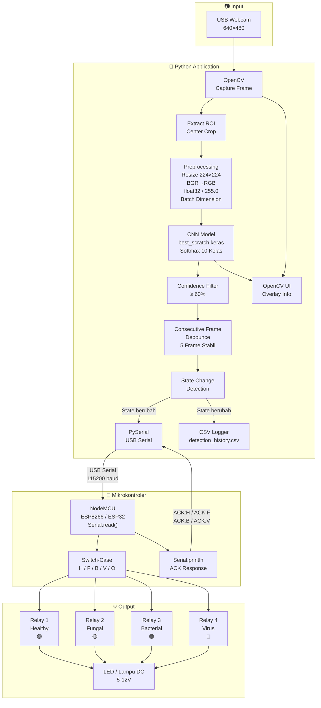
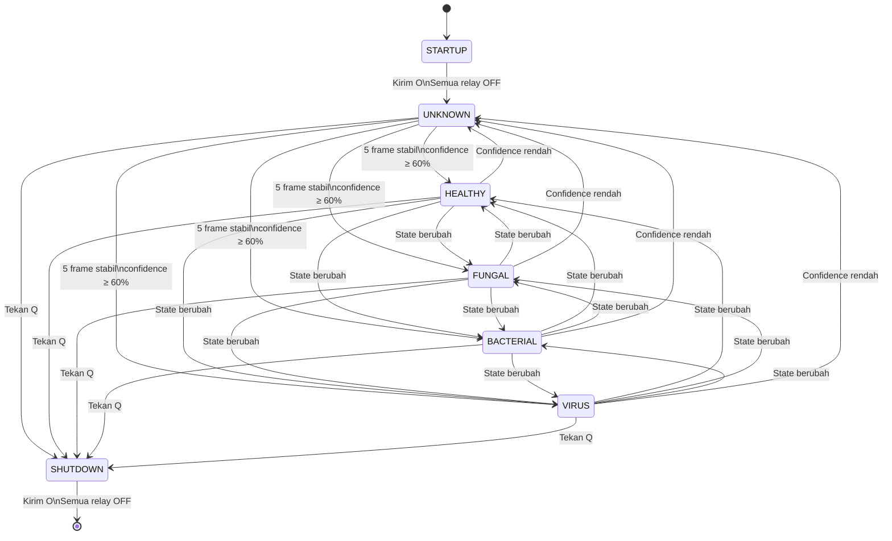
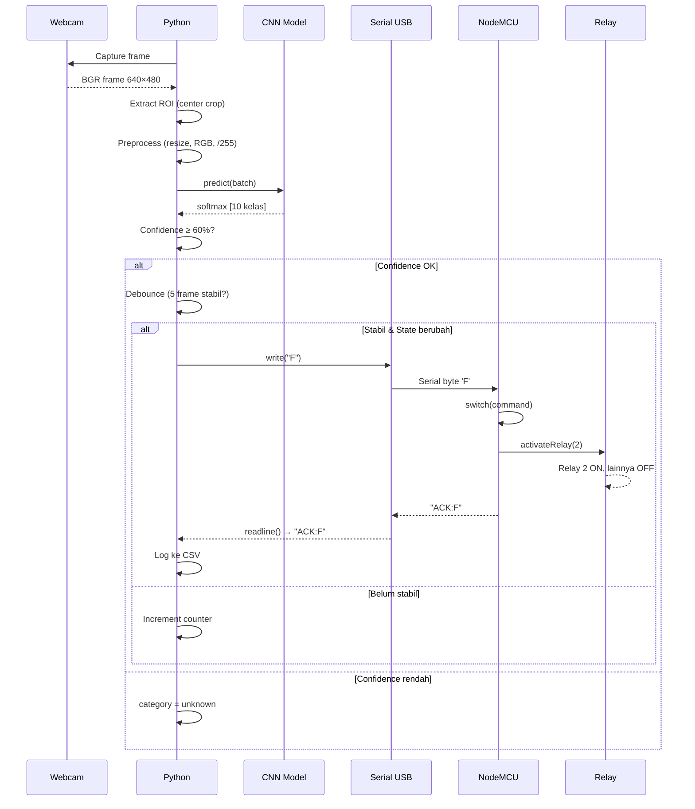
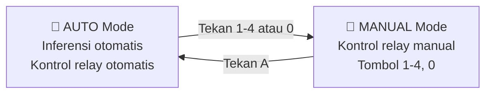

# Arsitektur Sistem — Tomato AIoT Relay Control

## Diagram Aliran Data

---

## Diagram State Machine

---

## Diagram Sequence — Alur Perintah Serial

---

## Pemetaan Perintah Serial

| Karakter | Kategori | Relay | Aksi |
|:---:|---|---|---|
| `H` | Healthy | Relay 1 ON | R2, R3, R4 OFF |
| `F` | Fungal | Relay 2 ON | R1, R3, R4 OFF |
| `B` | Bacterial/Pest | Relay 3 ON | R1, R2, R4 OFF |
| `V` | Virus | Relay 4 ON | R1, R2, R3 OFF |
| `O` | Unknown/OFF | Semua OFF | R1, R2, R3, R4 OFF |

---

## Mode Operasi

